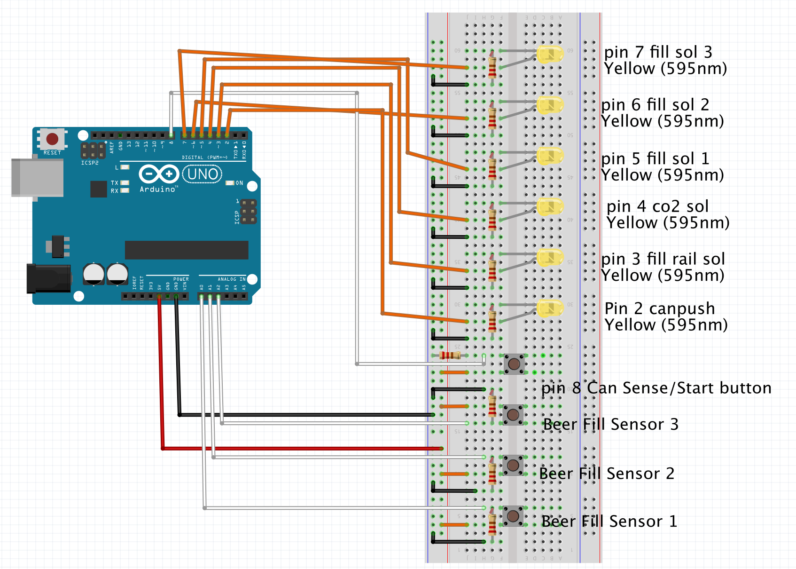

# Open Beer Filler

Open Beer Filler is an Arduino Uno sketch for controlling a beer filling line. The idea was started by Christopher Harrison-Hawkes AKA [HarryBrew69 on YouTube](https://www.youtube.com/channel/UCIIYTzYpd8D7y816diZB0Dw). The sketch works by controlling a beer bottling line via a Arduino Uno and various sensors.

## Configuration
Before uploading the sketch to your Arduino Uno be sure to modify the InputConfig.h and Config.h files to map it to your microcontroller pins. We have mapped the pins to default so if you follow the Schematic below it should work out of the box.

### InputConfig.h Definitions
VARIABLE | DEFINITION
--- | ---
START_BUTTON | The pin on which the start button is attached
BEER_INLET_SOL_1 | The pin controlling the solenoid for beer tube 1
BEER_INLET_SOL_2 | The pin controlling the solenoid for beer tube 2
BEER_INLET_SOL_3 | The pin controlling the solenoid for beer tube 3
BEER_FILL_SENSOR_1 | The pin that senses when the fill sensor for beer tube 1 is triggered
BEER_FILL_SENSOR_2 | The pin that senses when the fill sensor for beer tube 2 is triggered
BEER_FILL_SENSOR_3 | The pin that senses when the fill sensor for beer tube 3 is triggered
CO2_PURGE_SOL | The pin controlling the solenoid for releasing CO2
FILL_RAIL_SOL | The pin controlling the solenoid for lifting and dropping the filler rail
BEER_BELT_SOL | The pin controlling the solenoid for moving the beer line forward

### Config.h Definitions
VARIABLE | DEFINITION
--- | ---
CO2_PURGE_PERIOD | How long in milliseconds to purge with CO2 before filling with beer
CO2_PURGE_RETRACTION_PERIOD | How long in milliseconds to purge with CO2 after filling with beer, this happes mid lifting the filler tubes.
CO2_PURGE_RETRACTION_DELAY | How long in milliseconds to wait before starting CO2 purge after starting to retract filler tubes.
FILLER_TUBE_MOVEMENT_DELAY | How long in milliseconds to wait after raising/lowering filler tube before starting the next action like opening the filling lines.
MOVE_BEER_BELT_PERIOD | How long in milliseconds to run the beer belt solenoid for, ie how long should the beer belt move.
FILL_SENSORS_TIMER_DELAY | How often in the background should the timer check the Fill sensors' status, defaults to every 100ms.
CONINUOUS_FILLING | If this definition is enabled it will put the sketch in continous filling mode, meaning once it is done filling it will auto start with the next batch. This is for production use.
FILL_SENSORS_TRIGGER | Sensitivity of the fill sensors, a value between 0 and 1023 representing the detected voltage.

### Required Libraries
- [TimerOne](https://playground.arduino.cc/Code/Timer1/)

## Schematic

## Feature Requests
At present the sketch only supports the Arduino Uno, however we have plans in the works to introduce ESP8266 support with various other nice to have functionality such as remote setup, monitoring and control via a built in web page.

## Open Source
The project is completely Open Source licensed under the GPL version 3 or above so you are free to use this code as long as you just give attribution. If you have the ability to help us out then please feel free to submit pull requests or even just log issues for bugs or feature request.

## Troubleshooting

### Missing InputConfig.h & Config.h files in your build
If you are getting errors when trying to compile this sketch about missing Config.h and/or InputConfig.h files then it means your Arduino IDE is not picking up these files as part of the sketch. This is likely just an includes folder config error so check your includes folder paths.

It is also possible you are running an outdated version of the Arduino IDE, in that case ensure you are running version 1.8.10+ of the Arduino IDE.
